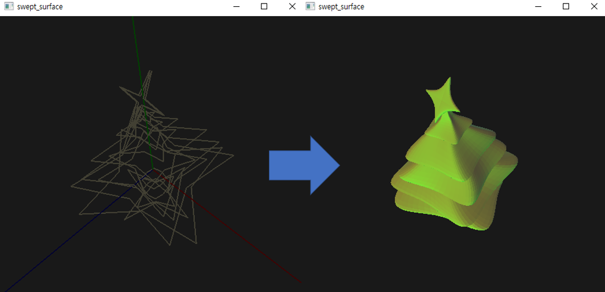
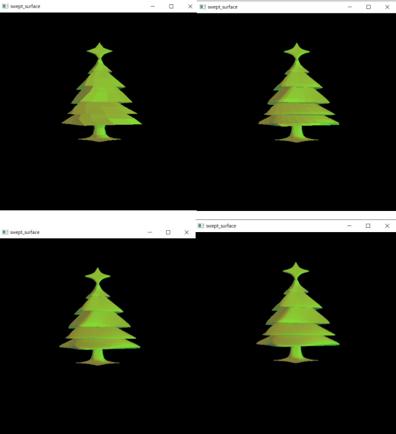

# Swept Surface Design System
This project implements a system for swept surface design using geometric transformations and spline curves. A swept surface is defined by a sequence of cross section curves, which are created using closed B-splines or Catmull-Rom splines. The cross sections are then transformed using scaling, rotation, and translation to construct a smooth swept surface that interpolates the cross sections.



## Requirements
```
pip install PyOpenGL PyOpenGL-accelerate numpy pyquaternion
```
## Usage
```
python swept_surface.py
```
## Results
examples of images at different resolutions

